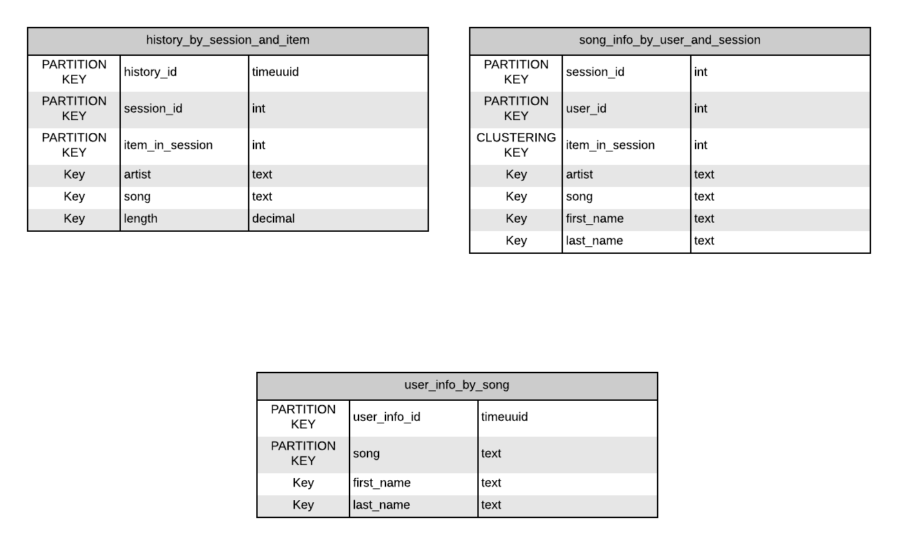

# NoSQL with Apache Cassandra
Database modeling in Apache Cassandra

# Structure
## Files

- images
- etl.ipnyb: Contains all elt code
- event_data/: contains csv files that will be used to populate our database

## Database Schema



# Usage
Setting cassandra instance with docker:

```
docker run --name cassandra-db -p 9042:9042 -d cassandra:latest;
```

Run the script `elt.ipynb` in order to populate the database.

# References

- https://www.youtube.com/watch?v=s1xc1HVsRk0&list=PLalrWAGybpB-L1PGA-NfFu2uiWHEsdscD
- https://hub.docker.com/_/cassandra
